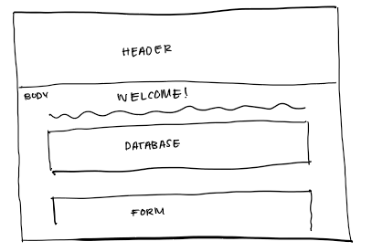
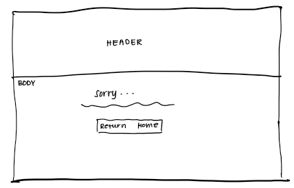
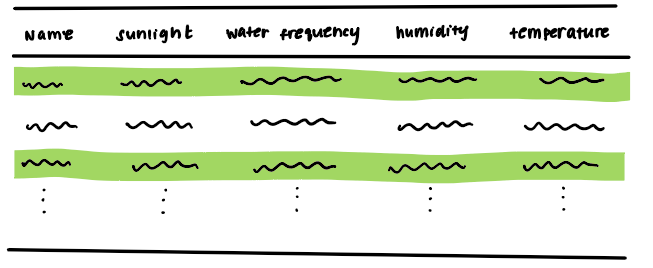
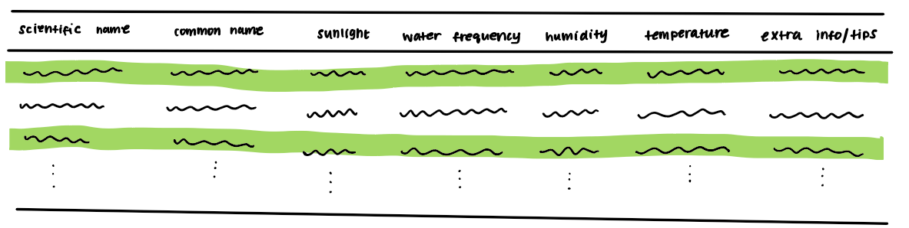
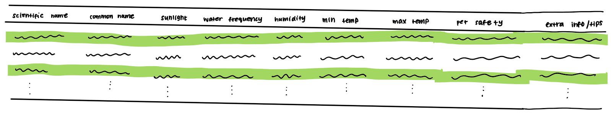
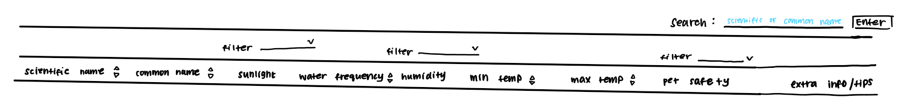
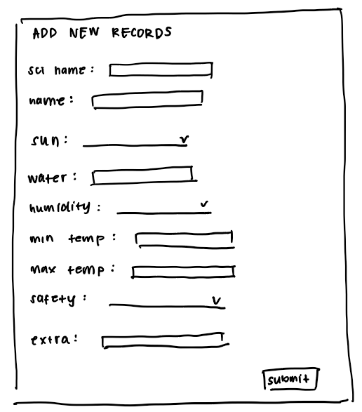

# Project 2: Design Journey

Be clear and concise in your writing. Bullets points are encouraged.

**Everything, including images, must be visible in Markdown Preview.** If it's not visible in Markdown Preview, then we won't grade it. We won't give you partial credit either. This is your warning.


## Design Plan

### Describe your Catalog (Milestone 1)
> What will your collection be about?
> What types of attributes will you keep track of for the *things* in your catalog? 1-2 sentences.

My collection will be about house plants, and I will keep track of the aspects you need to know in order to grow the houseplant. For example name, sunlight, water frequency, humidity, and temperature.


### Audiences (Milestone 1)
> Briefly explain your site's audiences. Be specific and justify why each audience is appropriate for your site.
> You are required to have **two** audiences. One to view the catalog. The other inserts records into the catalog.

Viewer: The viewers on my site are new to growing house plants and are coming to find basic information now how to care for various houseplants. They can also find plants for which they are able to meet the "care demand" in terms of water frequency, sunlight, temperature, etc.

Inserts New Records: The creators on my site are very familiar with houseplants and have knowledge about the important growing conditions for each plant. They are accurately able to fill out each of the attributes in the database, especially the extra information/tips, which requires personal experience with plants.


### Personas (Milestone 1)
> Your personas must have a name and a "depiction". This can be a photo of a face or a drawing, etc.
> There is no required format for the persona.
> You may type out the persona below with bullet points or include an image of the persona. Just make sure it's easy to read the persona when previewing markdown.
> Your personas should focus on the goals, obstacles, and factors that influence behavior of each audience.

> Persona for your "viewer" audience:

Persona's Name: Teo Brunetti


Factors that Influence Behavior
- Teo recently moved to San Francisco and bought an apartment
- He works a nine to five job and also goes on quite a few business trips
- He has a pet cat that he lives with

Needs/Obstacles/Desires
- He wants to decorate his house full of plants but doesn't know what to pick and he's never grown one before
- He is often traveling/on business trips so he wants his plants to be low maintenance and needs information about care-effort so he can make the right choice
- He wants plants that are safe for pets


> Persona for your "inserts new records" audience:

Persona's Name: Isa Tillens


Factors that Influence Behavior
- Isa is the owner of a small plant nursery and grows many different types of plants, especially houseplants
- She has sold many people their first plant and knows what kinds of questions and doubts beginners have
- Throughout the years Isa has learned many tips and tricks to taking care of plants

Needs/Obstacles/Desires
- She really enjoys sharing her knowledge about plants with others and she would like to help people learn more about growing houseplants
- Isa doesn't want to overwhelm people with a lot of care information initially
- She needs to provide individuals with some basic information about care before they decide to look further into a plant


### Site Design (Milestone 1)
> Document your _entire_ design process. **We want to see iteration!**
> Show us the evolution of your design from your first idea (sketch) to the final design you plan to implement (sketch).
> Show us the process you used to organize content and plan the navigation, if applicable (card sorting).
> Plan your URLs for the site.
> Provide a brief explanation _underneath_ each design artifact. Explain what the artifact is, how it meets the goals of your personas (**refer to your personas by name**).
> Clearly label the final design.




For my overall, website design I decided to choose something simple, with just a single page. The header gives information about website and that it is a database that gives information about houseplants. The body contains the database and the form for entering new records. I decided to include the form below the database so that it would be easy for Isa to view the records that already exist in the database as well as any updates she makes. For my 404 error page, I included a message saying the page could not be found and a link to the home page so that Isa or Teo can navigate back.



For my initial database design I decided to include the basic information needed to grow a plant: the name of the plant, the amount of sunlight it needs, the water frequency in days, the humidity (low, normal, or high), and temperature. This allows Isa to provide individuals like Teo with the basic information, and Teo can choose whether or not the plant is right for him based on this information.



In my second design, I decided to split the "name" into scientific, which is standardized, and common names, which could allow Teo  to find it easier. I also decided to include a section on extra tips, where she can link people to websites with more information on the plants. This way she doesn't overwhelm Teo with information from the start.



In my final design I decided to change temperature to min and max temperature. I felt that it would be harder to sort the temperature column if I kept the range as one entry. Moreover, if Teo likes to keep his apartment at 70℉ minimum, then he can sort the column to see which plants temperatures of 70℉ or higher. I also decided to add a column indicating whether it's safe for pets and babies, which will help Teo find plants that are safe for his cat. Overall, I felt this design best met the needs of Teo and Isa. With this design Isa is able to give Teo the basic information he needs to explore further. It also doesn't overwhelm Teo with a lot of information at once and it won't be word/description heavy. Isa also has the option to include extra resources for Teo if she thinks it will be helpful.



In terms of searching, sorting, and filtering I decided to allow Teo to sort the numerical and String values (scientific name, common name, watering frequency, and temperature) from least to greatest. This would allow him to more easily organize the data based on the factors he finds important when choosing a plant. Teo can also filter the categorical values (sunlight, humidity, pet safety), so that if Teo only wants plants that are safe for pets, he can see those specific plants. Additionally, if Teo chooses the "Medium Indirect" Sunlight filter and the "Normal" Humidity filter, the table will show plants that both thrive in medium indirect sunlight and normal humidity. I felt that connecting each of the filters with an AND clause will better help Teo find plants that meet all of his requirements. Finally, I have a search bar on the top right corner that searches the scientific and common names. If Teo already has a specific plant in mind, he can search for it to get more information. I decided to not allow searching of other fields such as sunlight or humidity since they can be filtered, and it may be confusing for Teo to both search and filter for "Normal" humidity plants, for example.



For my form, I decided to give it a title called "Add New Records" so that Isa would know where she can add information to the database. The form includes all the fields that need inputs and all the fields are required except for the last, extra information.

### Design Patterns (Milestone 1)
> Write a one paragraph reflection explaining how you used the design patterns for online catalogs in your site's design.

In my site's design I decided to create a minimalistic table where the headers are bolded and the rows and columns are separated by whitespace. Moreover, the background of my data rows will be alternating colors to allow for more distinction. Like most online catalogs, my search and sort features will be directly above the database. I will be sure to make a fixed header so that when Teo or Isa scroll through the table, they know what data they are looking at.


## Implementation Plan

### Database Schema (Milestone 1)
> Describe the structure of your database. You may use words or a picture. A bulleted list is probably the simplest way to do this. Make sure you include constraints for each field.

Table: houseplants
- id: INTEGER {PK, NN, U, AI},
- scientific_name: TEXT {NN, U},
- common_name: TEXT {NN},
- sunlight: TEXT {NN},
- water_frequency: INTEGER {NN},
- humidity: TEXT {NN},
- min_temp: REAL {NN},
- max_temp: REAL {NN},
- pet_baby_safety: TEXT {NN},
- extra_info: {}


### Database Query Plan (Milestone 1)
> Plan your database queries. You may use natural language, pseudocode, or SQL.

1. All records

    ```sql
    SELECT * FROM houseplants;
    ```

2. Insert record

    ```sql
    INSERT INTO houseplants (scientific_name, common_name, sunlight, water_frequency, humidity, min_temperature, max_temperature, pet_baby_safety, extra_info) VALUES (value1, value2, value3, value4, value5, value6, value7, value8, value9)
    ```

3. Search records

    ```sql
    SELECT * FROM houseplants WHERE (scientific_name LIKE '%something%' OR common_name LIKE '%something%');
    ```

4. Filter by 'sunlight'

    ```
    Filter plants by low indirect, medium indirect, high indirect, or direct sunlight
    ```

5. Sort by 'water_frequency'

    ```
    Sort houseplants by water_frequency (in days) increasing or decreasing
    ```

6. Filter by 'humidity'

    ```
    Filter plants by low, normal, or high humidity
    ```

7. Sort by 'min_temperature'

    ```
    Sort houseplants by min_temperature, increasing or decreasing
    ```

8. Sort by 'max_temperature'

    ```
    Sort houseplants by max_temperature, increasing or decreasing
    ```

9. Filter by 'pet_baby_safety'

    ```
    Filter houseplants by pet_baby_safety, yes or no
    ```

10. Sort by 'scientific_name'

    ```
    Sort houseplants by scientific name, alphabetical, increasing or decreasing
    ```


### Code Planning (Milestone 2)
> Plan any PHP code you'll need here using pseudocode.
> Use this space to plan out your form validation and assembling the SQL queries, etc.

Form validation:
```
if (user submits form) {
  if scientific name is empty
    show feedback
    make form invalid
  } else {
    format scientific name
    check if scientific name is unique
  }

  if (name is empty) {
    show feedback
    make form invalid
  }
  else {
    format name
  }

  if (sunlight is empty) {
    show feedback
    make form invalid
  }

  if (water is empty or is not numeric) {
    show feedback
    make form invalid
  }

  if (humidity is empty) {
    show feedback
    make form invalid
  }

  if (min temp is empty or is not numeric) {
    show feedback
    make form invalid
  }

  if (max temp is empty or is not numeric) {
    show feedback
    make form invalid
  }

  if (max temp is less than min temp) {
    show feedback
    make form invalid
  }

  if (safety is empty) {
    show feedback
    make form invalid
  }

  if (extra is empty){
    set to NULL
  }

  if (form is valid) {
    add record to database
    show confirmation
  }
  else {
    remember form values
  }
}
```
Fetch records:
```
fetch records from database --> store in array

for (each record in array) {
    echo data value for scientific name
    echo data value for common name
    echo data value for sunlight
    echo data value for water
    echo data value for humidity
    echo data value for min temp
    echo data value for max temp
    echo data value for safety
    echo data value for extra resources
}
```
Search records:
```sql
$query = $query . " WHERE scientific_name LIKE '%' || :search || '%' OR common_name LIKE '%' || :search || '%'";
$select_params[':search'] = $search_terms;
```
Filter records:
```
if (filters checked) {
  sun_filter is empty String
  has_sun_filter is false
  if (low indirect sunlight) {
    assemble sun_filter string
    has_sun_filter is true
  }
  if (medium indirect sunlight) {
    assemble sun_filter string
    has_sun_filter is true
  }
  if (high indirect sunlight) {
    assemble sun_filter string
    has_sun_filter is true
  }
  if (direct sunlight) {
    assemble sun_filter string
    has_sun_filter is true
  }

  humidity_filter is empty string
  has_humidity_filter is false
  if (low humidity) {
    assemble humidity_filter string
    has_humidity_filter is true
  }
  if (normal humidity) {
    assemble humidity_filter string
    has_humidity_filter is true
  }
  if (high humidity) {
    assemble humidity_filter string
    has_humidity_filter is true
  }

  safety_filter is empty string
  has_safety_filter is false
  if (yes safety) {
    assemble safety_filter string
    has_safety_filter is true
  }
  if (no safety) {
    assemble safety_filter string
    has_safety_filter is true
  }

  query = query + sun_filter + humidity_filter + safety_filter
}
```
Sort records:
```sql
sort is the header clicked
$sort = $_GET['sort']; // untrusted
$order = $_GET['order']; // untrusted
$order_next_url = array(
  'sciname' => 'asc',
  'name' => 'asc',
  'water' => 'asc',
  'mintemp' => 'asc',
  'maxtemp' => 'asc'
);
if ($order == 'asc') {
  $order_sql = 'ASC';
  $order_next = 'desc';
} else if ($order == 'desc') {
  $order_sql = 'DESC';
  $order_next = NULL;
} else {
  $order = NULL;
  $sort = NULL;
}
if (sort is a sortable header) {
  if ($sort == 'sciname') {
    $query = $query . ' ORDER BY scientific_name ' . $order_sql;
  } elseif ($sort == 'name') {
    $query = $query . ' ORDER BY common_name ' . $order_sql;
  } elseif ($sort == 'water') {
    $query = $query . ' ORDER BY water_frequency ' . $order_sql;
  } elseif ($sort == 'mintemp') {
    $query = $query . ' ORDER BY min_temp ' . $order_sql;
  } elseif ($sort == 'maxtemp') {
    $query = $query . ' ORDER BY max_temp ' . $order_sql;
  }
  $order_next_url[$sort] = $order_next;
}
$sort_url = '/?';
$sort_query = http_build_query(
  array(
    'query' => $search_terms,
    'lowsun' => $lowsun,
    'mediumsun' => $mediumsun,
    'highsun' => $highsun,
    'directsun' => $directsun,
    'lowhum' => $lowhum,
    'normalhum' => $normalhum,
    'highhum' => $highhum,
    'yes' => $yes_safety,
    'no' => $no_safety
  )
);
$sort_url = $sort_url . $sort_query;
```
Display records:
```
$records = exec_sql_query(
          $db,
          $query,
          $select_params
        )->fetchAll();
if (more than zero record) {
  display records
} else {
  display "No records found"
}
```


## Submission

### Audience (Final Submission)
> Tell us how your final site meets the needs of the audiences. Be specific here. Tell us how you tailored your design, content, etc. to make your website usable for your personas. Refer to the personas by name.

My website is a database with basic information about growing plants for beginners such as Teo. The site contains information on the scientific name, which is unique, the common name, which may or may not be unique, the amount of sunlight a plant should get, watering frequency, the humidity levels, minimum and maximum temperatures, whether or not it is safe for pets and babies, and finally, any extra resources. Teo can look through each of these factors to decide what plant is best for him. For example, since Teo has a cat and is often away on business trips, he may want a plant that does not need to be frequently watered and is safe for pets. Using the filtering and sorting mechanisms, Teo can choose to display plants that are only safe for pets and organize the water frequency column in descending order so he can see which plant does not need to be watered very often. Additionally, if Teo like his house be dark and at a normal to high humidity, he can apply the Sunlight and Humidity filters to find plants that prefers low indirect sunlight and either normal or high humidity. If Teo has heard of a certain plant before and wants to learn a bit more about caring for it, he can use the search bar to either search the scientific or common name of the plant. Searching for only the names ensures that Teo won't be confused by overlapping roles of the search bar and filters. Overall, the website design is well suited for Teo to explore various plants that match his preferences. It is also tailored towards people such as Isa, who have experience in growing plants and may want to contribute to the database. The form to submit a new record is located below the data table, so that Isa can view which plants have already been added when she scrolls down. The form has all the fields that may be inputted, as well as feedback messages. If Isa doesn't enter a certain required input, or her minimum temperature is greater than her maximum temperature, or she doesn't enter a number for water frequency, then the form will provide feedback specifying the issue so that Isa can easily fix it. Moreover, since Isa is an experienced plant-owner, if she feels there is some extra information that is necessary to know, she can add it to the optional "Extra Information" section. Once Isa has submitted the form, it will give a confirmation and inform her that her record has been added to database. If the record is not successfully added, it will inform her of that as well.


### Additional Design Justifications (Final Submission)
> If you feel like you haven’t fully explained your design choices in the final submission, or you want to explain some functions in your site (e.g., if you feel like you make a special design choice which might not meet the final requirement), you can use the additional design justifications to justify your design choices. Remember, this is place for you to justify your design choices which you haven’t covered in the design journey. You don’t need to fill out this section if you think all design choices have been well explained in the design journey.


### Self-Reflection (Final Submission)
> Reflect on what you learned during this assignment. How have you improved from Project 1? What things did you have trouble with?

From this assignment, I learned a lot about databases. Databases and SQL were things I have never worked with before, so it was initially a little challenging to figure out to how to combine SQL with PHP. However, after being able to view the SQL queries in my console, it became much easier to figure out what I was writing and how to write the SQL commands. It was also a little challenging to figure out the logic for filtering and sorting, but after implementing the methods line by line and frequently checking if I was getting the expected output, I was able to understand the logic much better. The two areas that I improved in from Project 1 would be PHP and CSS. This time around, I didn't really have to reference my notes on PHP syntax as much and I felt more "fluent" in writing PHP code. I was also able to learn a lot more about CSS since this time I had my own vision of what I wanted my site to look like, rather than basing it off of the example site. Compared to my Project 1, I think my Project 2 styling improved greatly.


### Grading: Mobile or Desktop (Final Submission)
> When we grade your final site, should we grade this with a mobile screen size or a desktop screen size?

Desktop


### Grading: Partials (Final Submission)
> We will only grade the pages with the catalog.
> Please specify all URLs for the catalog (search, insert, view, etc.)

- <https://localhost:3000/>
