# Project 3: Design Journey

Be clear and concise in your writing. Bullets points are encouraged.

**Everything, including images, must be visible in Markdown Preview.** If it's not visible in Markdown Preview, then we won't grade it. We won't give you partial credit either. This is your warning.

## Design Plan

### Project 1 or 2

> Do you plan to reuse your Project 1 or 2 site?
> Which project?

I do not plan to reuse my Project 1 or 2.

> If yes, please include sketches of the site's current design (you may copy the "final" sections from those assignments.)

N/A

### Describe your Media Catalog (Milestone 1)

> What will your collection be about?
> What type of media will your site display? (images, videos, audio)

My collection will be about contemporary artworks from around the world, and m site will display images of the art works.

### Audiences (Milestone 1)

> Briefly explain your site's audiences. Be specific and justify why each audience is appropriate for your site.
> You are required to have **two** audiences: "information consumers" and "site administrators"

Information Consumer: The information consumers on my site are individuals who are interested in contemporary art and want to know more about the various artists and artworks around the world. These people can visit the website and filter the catalog based on the medium of the art, location, and topic, which will allow them to find types of artworks that are near them and about topics they're interested in.

Site Administrator: The administrators of my site are individuals who are experienced in modern art, and many are contemporary artists themselves. They are accurately able to update the website with new works or remove certain works. A lot of the administrators add their own artworks to the website to reach a larger audience.

### Personas (Milestone 1)

> Your personas must have a name and a "depiction". This can be a photo of a face or a drawing, etc.
> There is no required format for the persona.
> You may type out the persona below with bullet points or include an image of the persona. Just make sure it's easy to read the persona when previewing markdown.
> Your personas should focus on the goals, obstacles, and factors that influence behavior of each audience.

> Persona for your "consumer" audience:

Persona's Name: Lea Cooper


Factors that Influence Behavior

- Lea has recently developed an interest in modern art
- She would like to learn more about the various modern artworks and artists
- She lives in Switzerland
- Lea is especially interested in modern art that focuses on social issues (race, sexuality, etc.)
  Needs/Obstacles/Desires
- Lea wants a catalog that allows her to explore different artworks from around the world; diversity is important to her
- She would also want information on the artist, the location, and the topic of the artwork (if applicable)
- Lea wants to visit the museums where the art pieces are located, but she cannot travel outside Europe

> Persona for your "administrator" audience:

Persona's Name: Tim Grant


Factors that Influence Behavior

- Tim is passionate about modern art and has studied a lot about various movements around the world
- He visits many art museums around the world and is well educated about them
- Tim is also a modern artist himself and creates work that focuses on race and culture
  Needs/Obstacles/Desires
- Tim wants to be able to share his work and the work of others with those interested in modern art
- It's important to him that viewers understand the topic of the work and have just enough information to create their own interpretation
- Sometimes information about an artwork can change and Tim wants to be able to easily update it

### Site Design (Milestone 1)

> Document your _entire_ design process. **We want to see iteration!**
> Show us the evolution of your design from your first idea (sketch) to the final design you plan to implement (sketch).
> Show us the process you used to organize content and plan the navigation, if applicable (card sorting).
> Plan your URLs for the site.
> Provide a brief explanation _underneath_ each design artifact. Explain what the artifact is, how it meets the goals of your personas (**refer to your personas by name**).
> Clearly label the final design.


For my initial website layout I thought of having the introduction to the website, the catalog and filtering, and the adding form on one page with the login on a separate page. This would allow Lea and Tim to easily scroll through the content. However, I realized that if there are a lot of artworks added then it would not be a good user experience for Tim to have to scroll down all the way to the bottom of the page in order to fill out the form.

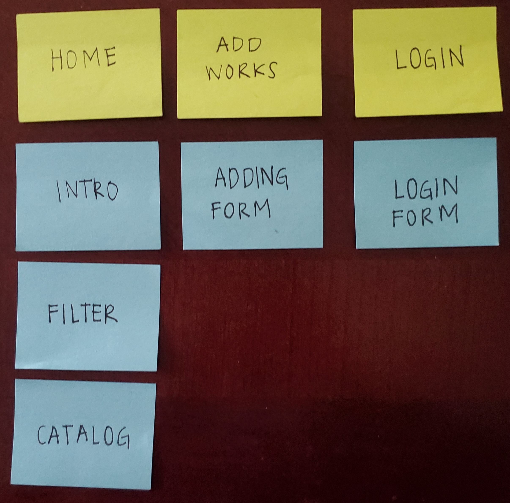

Considering user experience issues with my last layout, I decided to move the add-form to a separate section, so that Tim would be easily able to add new works to the catalog, by navigating to the Add Works page.

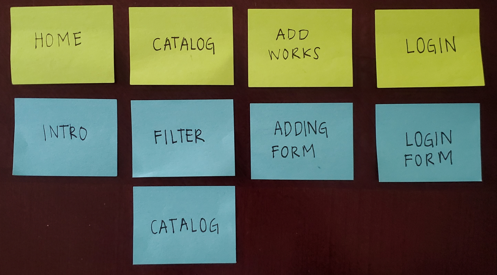

For my final layout, I felt that it would help if the catalog was on its own page and the introduction was on the home page. This way when Lea or Tim first visit the website, they can see what it is about and then navigate to the catalog page to browse art works. I also have the login on a separate page, so that Tim would know where to sign in and make updates.

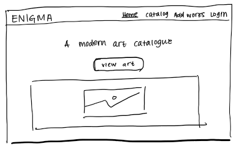

For my homepage design, I decided to keep it simple. The top contains the navigation bar with the website's name (Enigma), and to the left there are the different pages Tim or Lea can navigate to (Home, Catalog, Add Works, and Login). The home page is underlined to indicate to Tim or Lea that they are on the home page, and there is a small description indicating that the website is a modern art catalog and a button to take them to the artworks.

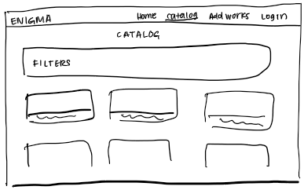

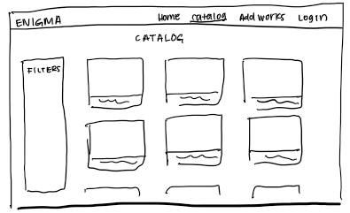

For my initial catalog page design, I decided to make the layout similar to my Project 2, with the filters at the top. However, I decided that it would be a better usability experience for Tim and Lea to have the filters on the side with tags separated by category since this is more common in web design. Therefore, I changed by design for my catalog page to have an array of the images along with a sidebar on the left for tags.

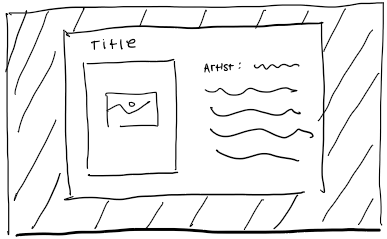

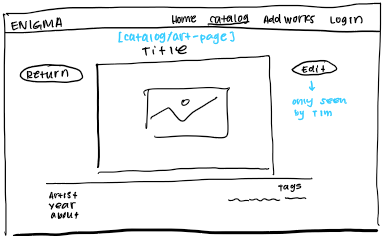

When Tim or Lea clicks on the card with the artwork, I initially decided to make the card pop-out on the page (using JavaScript). I thought this way the they can easily click on the card to blow it out, view the information, then click away to minimize it, and continue browsing. However, I decided to change this, and instead take them to a separate page to view the work. This way it would be easier for Tim and Lea to fully view the art. Also, it would be easier for Tim to make any changes this way, rather than on a modal.

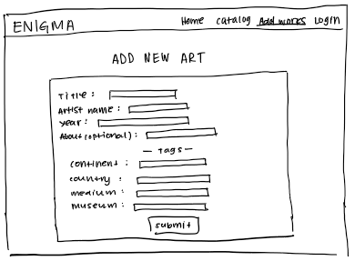

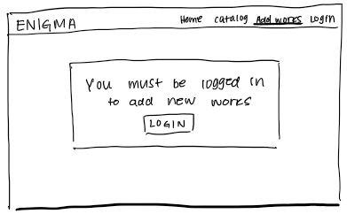

The first Add Works page design is what Tim will see when he logs in. It provides the fields that are required and feedback as needed, so that Tim can accurately fill out the form. The form requires information about the artwork's title, the artist's name, and year. Tim can also choose to include additional information about the topic of the work if he feels it's appropriate. He will then have to enter the relevant tags in the appropriate categories and upload an image of the work. The second Add Works page design is what Lea will see and what Tim will see when he's not logged in. This will ensure that Lea will not get confused when she goes to the Add Works page. Instead, she will see that she needs to be logged in and that she is not authorized. For Tim, he will be reminded that he needs to login, and he can click the button to be taken to the login page.

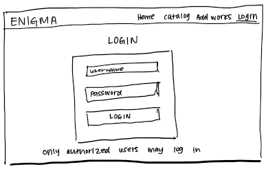

The last page on my navigation bar is the login page. This gives fields for Tim to enter his login information and let's Lea know that only authorized users may login, if she comes across this page. The login form will also give Tim feedback, so that if he's logged in, it will say that.

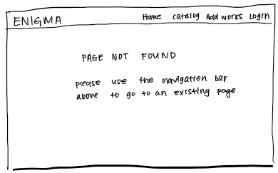

Finally, for my 404 page, I will show a message to Tim or Lea saying that the page could not be found and that they should use the navigation bar above to go to another page.

URLS:
| Route | PHP File |
| ----------------- | ----------------------------------- |
| / or /home | pages/home.php |
| /catalog | pages/catalog.php |
| /catalog/art-page | pages/art_page.php |
| /add-works | pages/add_works.php |
| /login | pages/login.php |
| anything else | pages/404.php |

### Design Patterns (Milestone 1)

> Write a one paragraph reflection explaining how you used the design patterns in your site's design.

In my catalog, I used design patterns such as only allowing authorized users to make changes to the website, which prevents confusion and accidental changes. I also provide specific, user-friendly feedback on my forms in the Add Works page and Login page, so that Tim will know exactly what's wrong when the form doesn't submit correctly. When creating my catalog, I decided to make the images blow out on the page when clicked, since it is much more intuitive for users like Tim and Lea in this way. Additionally, I have a 404 page, so that if Tim or Lea go to a page that doesn't exist, they'll know what to do.

## Implementation Plan

### Requests (Milestone 1. Revise in Milestone 2)

> Identify and plan each request you will support in your design.
> List each request that you will need (e.g. view image details, view gallery, edit book, tag product, etc.)
> For each request, specify the request type (GET or POST), how you will initiate the request: (form or query string URL), and the HTTP parameters necessary for the request.

- Request: view image details

  - Type: GET
  - URL: /catalog/art-page?id=X
  - Params: id (items.id in DB)

- Request: edit image

  - Type: POST
  - URL: /catalog/art-page?edit=X
  - Params: id (items.id in DB)

- Request: add entry

  - Type: POST
  - URL: /add-works
  - Params: artwork_title (items.artwork_title in DB), artist_name (items.artist_name in DB), year (items.creation_year in DB), about (items.about in DB), filename (items.filename in DB), file_ext (items.file_ext in DB), source (items.source in DB), tag (tags.tag in DB)

- Request: delete entry

  - Type: POST
  - URL: /catalog/art-page?id=X
  - Params: id (items.id in DB)

- Request: log in

  - Type: POST
  - URL: /login
  - Params: username (users.username in DB) and password (users.password in DB)

- Request: filter
  - Type: GET
  - URL: /catalog/tagA=1&tagB=1&filter=
  - Params: tag (tags.tag in DB)

### Database Schema (Milestone 1. Revise in Milestone 2)

> Describe the structure of your database. You may use words or a picture. A bulleted list is probably the simplest way to do this. Make sure you include constraints for each field.

> Hint: You probably need a table for "entries", `tags`, `"entry"_tags` (stores relationship between entries and tags), and a `users` tables.

> Hint: For foreign keys, use the singular name of the table + \_id. For example: `image_id` and `tag_id` for the `image_tags` (tags for each image) table.

Table: items

- id: INTEGER {PK, NN, U, AI},
- artwork_title: TEXT {NN},
- artist_name: TEXT {NN},
- creation_year: INTEGER {NN},
- about: TEXT {},
- filename: TEXT {NN},
- file-ext: TEXT {NN},
- source: TEXT {NN}

Table: tags

- id: INTEGER {PK, NN, U, AI},
- tag: TEXT {NN, U},
- category: TEXT {NN}

Table: item_tags

- id: INTEGER {PK, NN, U, AI},
- item_id: INTEGER {NN},
- tag_id: INTEGER {NN}

Table: users

- id: INTEGER {PK, NN, U, AI},
- first_name TEXT {NN},
- last_name TEXT {NN},
- username: TEXT {NN, U},
- password: TEXT {NN}

Table: sessions

- id: INTEGER {PK, NN, U, AI},
- user_id INTEGER {NN},
- session TEXT {NN},
- username: INTEGER {NN, U},
- password: INTEGER {NN, U}

### Database Query Plan (Milestone 1. Revise in Milestone 2)

> Plan your database queries. You may use natural language, pseudocode, or SQL.

Fetch all records:

```sql
SELECT * FROM items;
```

Fetch records with certain tag:

```sql
SELECT * FROM items INNER JOIN item_tags ON item_tags.item_id = items.id INNER JOIN tags ON tags.id = item_tags.tag_id WHERE tags.tag = :tag;,
  array(
      'tag' => $tag,
  )
```

Add a certain record:

```sql
INSERT INTO items (artwork_title, artist_name, creation_year, about, filename, file_ext, source) VALUES (:title, :art_name, :year, :about, :filename, :ext, :source);,
  array(
    ':title' => $title,
    ':art_name' => $name,
    ':year' => $year,
    ':about' => $about,
    ':filename' => $filename,
    ':ext' => $file_ext,
    ':source' => $source,
  )
INSERT INTO item_tags (item_id, tag_id) VALUES (:item_id, :tag_id);,
  array(
    ':item_id' => $art_id,
    ':tag_id' => $tag_id
  )
```

Delete a certain record:

```sql
DELETE FROM items WHERE id=:id;,
  array(
    'id' => $art_id,
  )
DELETE FROM item_tags WHERE items_id=:id;,
  array(
    'id' => $art_id,
  )
```

Update a certain record:

```sql
UPDATE items SET artwork_title = :title, artist_name = :name, creation_year = :year, about = :about WHERE id = :id;,
  array(
    ':id' => $art_id,
    ':title' => $title,
    ':name' => $name,
    ':year' => $year,
    ':about' => $about
  )
```

Fetch tags for a record:

```sql
SELECT * FROM tags LEFT OUTER JOIN item_tags ON item_tags.tag_id=tags.id LEFT OUTER JOIN items ON item_tags.item_id=items.id WHERE items.id = :id;,
  array(
    ':id' => $artwork['id']
  )
```

Add tags:

```sql
INSERT INTO tags (tag, category) VALUES (:tag, :category);,
  array(
    ':tag' => $tag,
    ':category' => $category,
  )
```

Remove tags for a certain record:

```sql
DELETE FROM item_tags WHERE (item_id=:item_id) AND (tag_id=:tag_id);,
  array(
    ':item_id' => $art_id,
    ':tag_id' => $tag_id
  )
```

### Code Planning (Milestone 1. Revise in Milestone 2)

> Plan any PHP code you'll need here using pseudocode.
> Use this space to plan out your form validation and assembling the SQL queries, etc.
> Tip: Break this up by pages. It makes it easier to plan.

Add record form validation:

```
if(user is logged in) {
  if (user submits form) {
    if (artwork title is empty)
      show feedback
      make form invalid
    }

    if (artist name is empty) {
      show feedback
      make form invalid
    }

    if (year is empty or is not numeric) {
      show feedback
      make form invalid
    }

    if (about is empty) {
      about = NULL;
    }

    if (file is empty) {
      show feedback
      make form invalid
    }

    if (source is empty) {
      show feedback
      make form invalid
    }

    if(continent is empty) {
      continent = NULL;
    } else {
      $continents_array = explode(",", $continent);
    }
    if(country is empty) {
      country = NULL;
    } else {
      $country_array = explode(",", $country);
    }
    if(medium is empty) {
      medium = NULL;
    } else {
      $medium_array = explode(",", $medium);
    }
    if(museum is empty) {
      museum = NULL;
    } else {
      $museum_array = explode(",", $museum);
    }

    if (form is valid) {
      add record to database
      if(tags not in database){
        add tags to database
      }
      add item_id and tag_id to item_tags
      add file to /uploads/items/
      show confirmation
    }
    else {
      remember form values
    }
  }
}
```

Edit record form validation:

```
if(user is logged in){
  if (user saves edits) {
    if (artwork title is empty)
      show feedback
      make form invalid
    }

    if (artist name is empty)
      show feedback
      make form invalid
    }

    if (year is empty or is not numeric) {
      show feedback
      make form invalid
    }

    if (source is empty) {
      show feedback
      make form invalid
    }

    if (about is empty){
      about = NULL;
    }

    if(continent is empty){
      continent = NULL;
    } else {
      $continents_array = explode(",", $continent);
      check if already tagged
    }
    if(country is empty){
      country = NULL;
    } else {
      $country_array = explode(",", $country);
      check if already tagged
    }
    if(medium is empty){
      medium = NULL;
    } else {
      $medium_array = explode(",", $medium);
      check if already tagged
    }
    if(museum is empty){
      museum = NULL;
    } else {
      $museum_array = explode(",", $museum);
      check if already tagged
    }

    if (form is valid) {
      update changes
      if(tags not in database){
        add tags to database
      }
      add item_id and tag_id to item_tags for new tags
      remove item_id and tag_id from item_tags for removed tags
      show confirmation
    }
    else {
      remember form values
    }
  }
}
```

Delete record:

```
if(user is logged in){
  if(user presses delete){
    show confirmation
  }
  if(user confirms){
      delete record
      delete tags
      delete image
      show confirmation
  }
}
```

Filter by tag:

```
foreach (continent_tag in continents) {
  if (tag is checked) {
    add to filter query
  }
}
foreach (country_tag in countries) {
  if (tag is checked) {
    add to filter query
  }
}
foreach (medium_tag in mediums) {
  if (tag is checked) {
    add to filter query
  }
}
foreach (museum_tag in museum) {
  if (tag is checked) {
    add to filter query
  }
}
build filter query
```

## Submission

### Audience (Final Submission)

> Tell us how your final site meets the needs of the audiences. Be specific here. Tell us how you tailored your design, content, etc. to make your website usable for your personas. Refer to the personas by name.

My site is a website for viewing modern art works. It allows people such as Lea who are new to modern to explore different works from around the world. When Lea first visits the website, she will see the home page, which explains what the website is about. The "Catalog" page allows Lea to filter by various categories based on what she's interested in. For example, if Lea is interested in Asian artworks then she can choose the "Asia" filter under the continents section. On the other hand, if Lea already has a specific country in mind, then she can choose that place under the country section. Lea can also filter by the mediums of the works or the museums they are located in, and each of the sections filter inclusively. This means that if Lea chooses "Singapore" and "Oil Painting" then she will find oil paintings from Singapore. This will allow Lea to better narrow down the type of art she is looking for. When Lea clicks on a specific work, she will see more information about the work, such as the artist, the year, the source, and any background information about work. It also contains certain tags, and if Lea clicks on them, she will find more artworks related to that tag. The "Add Works" page of the website contains a notice that authorized users must log in before adding art works. This will inform Lea that she cannot add works, and if an administrator such as Tim tries to add a work, then he will be reminded to log in. Once Tim logs in, he can go to the "Add Works" page to add new pieces of art. The form gives specific feedback so that Tim will know exactly why the record was not added, and if the submission is successful, it will inform him. It also gives directions such as separating tags by a comma so that Tim can correctly fill out the information. Tim can also edit works when he visits the catalog page, but clicking on an artwork. This will display an edit button at the top right corner, which is only visible to administrators so that Lea doesn't get confused. When Tim clicks this button he can update or delete the work.

### Additional Design Justifications (Final Submission)

> If you feel like you haven’t fully explained your design choices in the final submission, or you want to explain some functions in your site (e.g., if you feel like you make a special design choice which might not meet the final requirement), you can use the additional design justifications to justify your design choices. Remember, this is place for you to justify your design choices which you haven’t covered in the design journey. You don’t need to fill out this section if you think all design choices have been well explained in the design journey.

N/A

### Self-Reflection (Final Submission)

> Reflect on what you learned during this assignment. How have you improved from Project 1? What things did you have trouble with?

During this assignment I learned a lot more about databases and how to use multiple databases on a website. I also learned a lot about supporting user login and user access controls. The final major takeaway from this project was creating a database with images. Compared to Project 1, I think I improved a lot in my ability to design an aesthetic website and create the best user experience. I feel my site for Project 3 looks much more professional and there is a lot more that the user can do (it is much more interactive). However, some things I found challenging was creating my SQL queries for filtering. Since I was dealing with multiple databases, it was a little harder to filter. I also had to consider all these databases and information when I was adding, updating, and deleting works, which was a lot to keep track of. Overall, completing Project 3 felt very rewarding and I am quite proud of what I was able to accomplish.

### Grading: Mobile or Desktop (Final Submission)

> When we grade your final site, should we grade this with a mobile screen size or a desktop screen size?

Desktop

### Grading: Step-by-Step Instructions (Final Submission)

> Write step-by-step instructions for the graders.
> The project if very hard to grade if we don't understand how your site works.
> For example, you must login before you can delete.
> For each set of instructions, assume the grader is starting from /

Viewing all entries:

1. Go to catalog page

View all entries for a tag:

1. Go to catalog page
2. Click on tag category (e.g. Continent)
3. Click on tags (e.g. North America)
4. Press "Apply Filter"

OR

1. Go to catalog page
2. Click on art work (e.g. A Subtlety)
3. Click on a tag under art work (e.g. Sugar)

View a single entry and all the tags for that entry:

1. Go to catalog page
2. Click on art work (e.g. A Subtlety) --> tags are listed under art work

How to insert and upload a new entry:

1. Go to log in page and log in (username: tim & password: monkey)
2. Go to add works page and fill out form (source can be a url or description & separate tags by a comma)
3. Submit form and visit catalog page --> the uploaded work should appear

How to delete an entry:

1. Go to log in page and log in (username: tim & password: monkey)
2. Go to catalog page and click on entry
3. Click on edit button
4. Click delete at bottom

How to view all tags at once:

1. Go to catalog page
2. Open all tag categories (Continent, Country, Medium, Museum)

How to add a tag to an existing entry:

1. Go to log in page and log in (username: tim & password: monkey)
2. Go to catalog page and click on entry
3. Click on edit button
4. Type in tag under correct section

How to remove a tag from an existing entry:

1. Go to log in page and log in (username: tim & password: monkey)
2. Go to catalog page and click on entry
3. Click on edit button
4. Check the tag to be removed
